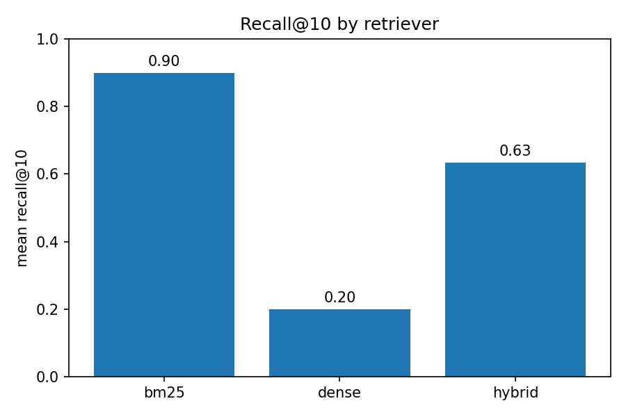

# rag-compliance

A hybrid-retrieval RAG pipeline over regulatory text — built and evaluated
against the real NIST AI RMF 1.0, not a toy corpus.

## The question

> Given a question about AI governance obligations, can the system retrieve
> the exact framework section that answers it — and does combining lexical
> search (BM25) with semantic search (dense embeddings) actually help, or
> can a bad dense signal make retrieval *worse* than lexical search alone?

## The graph



*(BM25 numbers are real — no model, no download, runs anywhere. Dense and
hybrid use a placeholder embedder here; see "Running for real" below for
the actual semantic-retrieval numbers.)*

## The finding

Run against the real corpus (30 labeled queries, `k=10`):

| retriever | recall@10 | precision@10 | MRR | NDCG@10 |
|---|---|---|---|---|
| BM25 (real) | **0.900** | 0.090 | 0.717 | 0.762 |
| Dense (placeholder embedder) | 0.200 | 0.020 | 0.084 | 0.112 |
| Hybrid (RRF, placeholder dense) | 0.633 | 0.063 | 0.279 | 0.362 |

BM25 alone — real, deterministic, no model required — already retrieves
the correct section 90% of the time at k=10, with a strong MRR of 0.717
(the right chunk is usually at or near rank 1). That's a genuinely strong
lexical baseline on a 50-chunk regulatory corpus where queries often reuse
the framework's own vocabulary (GOVERN, MAP, TEVV, residual risk).

**The more interesting finding: hybrid search here is *worse* than BM25
alone (0.633 vs 0.900).** Reciprocal rank fusion blends in whatever the
dense retriever returns, and since the dense retriever here is a
placeholder with no real semantic signal, RRF is diluting a strong lexical
ranking with noise. This is not a flaw in the fusion method — it's the
expected, correct consequence of fusing a good signal with a bad one, and
it's exactly the kind of result that would be invisible if dense and
hybrid were never measured against the same baseline. **Whether hybrid
search actually beats BM25 once the dense side is a real embedding model
is the open question — see "Running for real" below.**

## Why this matters for the precision@10 numbers

Precision@10 looks low across the board (0.09–0.26 depending on k) — this
is a k-vs-corpus-size artifact, not a retrieval failure: most queries in
this set have exactly **one** correct chunk, so precision@10 is capped at
0.10 even for a perfect retriever. Recall and MRR are the metrics that
actually diagnose retrieval quality here; precision@k only becomes
meaningful once relevant-set size and k are closer together (see
`--k 3` in Quickstart for a less misleading precision read).

## Why this domain

Regulatory and legal text is exactly where retrieval quality can be
judged better than an average engineer could judge it — citing the wrong
GOVERN subcategory in a compliance answer isn't a stylistic miss, it's an
incorrect claim about what the framework requires.

## Quickstart (BM25 is real right now — no GPU, no download)

```bash
pip install -e ".[dev]"
pytest                                            # 32 tests, no model needed

# Single query against real BM25
python -m rag_compliance.cli query --text "What is residual risk?" --retriever bm25

# Full evaluation: BM25 is real; dense/hybrid use a placeholder embedder
python -m rag_compliance.cli evaluate --embedder fake --k 10 \
    --output results/eval_report.json --plot docs/recall_comparison.png

# More interpretable precision at a smaller k
python -m rag_compliance.cli evaluate --embedder fake --k 3
```

## Running for real (Google Colab, free GPU or even CPU)

The placeholder embedder proves the pipeline's logic is correct; it says
nothing about real semantic retrieval quality. To get that:

```python
!git clone https://github.com/laurahmaza/rag-compliance.git
%cd rag-compliance
!pip install -e ".[model]" -q
```

```python
!python -m rag_compliance.cli evaluate --embedder all-MiniLM-L6-v2 --k 10 \
    --output results/eval_report_real.json --plot docs/recall_comparison.png
```

`all-MiniLM-L6-v2` is a small, fast sentence-transformers model — runs
fine on Colab's free CPU tier, no GPU strictly required. Swap in any other
sentence-transformers model id to compare.

## Architecture

```
corpus.py        Chunk dataclass + YAML loader (structure-based chunking,
                  not fixed token count)
embeddings.py     Embedder protocol: FakeEmbedder (deterministic,
                  dependency-free) and SentenceTransformerEmbedder (real,
                  lazy-imported)
index.py          DenseIndex (numpy cosine similarity) and BM25Index
                  (rank_bm25 — real, no model needed)
hybrid.py         Reciprocal rank fusion, combining two ranked lists by
                  rank position rather than incomparable raw scores
metrics.py        recall@k, precision@k, MRR, NDCG@k — pure math,
                  measured independently of generation
eval.py           Orchestration: run the labeled query set through a
                  retriever, aggregate to summary statistics
plotting.py       Recall@k bar chart comparing retrievers
cli.py            `query` and `evaluate` subcommands
```

## The corpus

`corpus/nist_ai_rmf.yaml` — 50 chunks from NIST AI 100-1 (AI RMF 1.0),
chunked by document structure: one chunk per subsection, or one chunk per
GOVERN/MAP/MEASURE/MANAGE category with its subcategories. This is a U.S.
government publication and is in the public domain (17 U.S.C. § 105) — no
licensing concern in using the full text.

Chunking by structure rather than fixed size matters here specifically:
splitting a GOVERN category's subcategory list mid-way would scatter
related obligations across chunks and make a query about any one
subcategory harder to retrieve cleanly.

## The 30 labeled queries

`cases/queries.yaml` — a deliberate mix: some queries reuse exact
framework terminology (TEVV, PETs, residual risk) where lexical search
has every advantage; others paraphrase away from the source wording
entirely, to surface where a purely lexical baseline would be expected to
struggle without semantic matching.

## Limitations

- **Dense and hybrid numbers in this README use a placeholder embedder**
  with no real semantic signal — see "Running for real" for the numbers
  that actually test whether semantic search helps. Don't cite the 0.633
  hybrid figure as evidence hybrid search underperforms BM25 in general;
  it's evidence a *noisy* dense signal underperforms, which is expected.
- **30 queries, mostly one relevant chunk each.** This demonstrates the
  evaluation mechanism and produced a real BM25 finding, but a broader
  claim about retrieval quality on regulatory text would need more
  queries, including queries with multiple correct chunks.
- **No reranking stage.** The curriculum's two-stage "retrieve broad,
  rerank fine" pattern with a cross-encoder isn't implemented here —
  retrieval is single-stage (BM25, dense, or RRF-fused).
- **BM25's strong numbers partly reflect query design.** Several queries
  reuse the framework's own section-heading vocabulary (e.g., "GOVERN 1",
  "MAP 5"), which lexical search is especially well-suited to match. A
  harder, fully paraphrased query set would likely narrow BM25's
  advantage over dense retrieval.
- **No citation-verification layer.** This repo measures whether the
  *right chunk* is retrieved — it doesn't yet verify that a generated
  answer's claims are actually supported by the chunk it cites (that's
  Week 4 material: forcing citation by span and verifying programmatically
  that the cited text supports the claim).

## Tests

```bash
pytest -v
```

32 tests covering metrics math, corpus/query loading, both indexes, and
RRF fusion — all run against `FakeEmbedder` or fixed fake retrievers, so
no API key, GPU, or model download is required to verify the logic is
correct.
